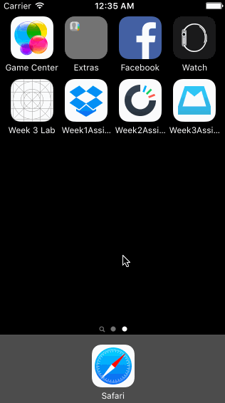

# iOS Bootcamp Assignment 3

This a demo app for the 3rd week of iOS Bootcamp. It includes more complex animations. 

Time Spent: 10 hours in total

Completed User Stories

 * [x] Required: User can drag message left or right and it will snap back if within 60 points of edge
 * [x] Required: User can drag left past 60 points and see the reschedule view
 * [x] Required: User can drag left past 260 pts and see the list view
 * [x] Required: User can drag right past 60 pts and archive a message
 * [x] Required: User can drag right past 260 and delete a message

 

GIF created with [LiceCap](http://www.cockos.com/licecap/).
